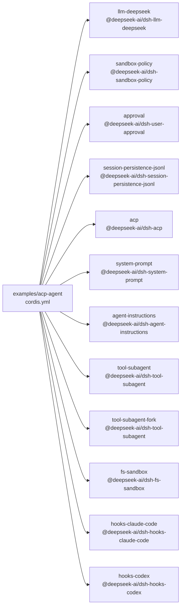

<!-- Generated by scripts/gen-doc-graphs.ts - do not edit by hand.
     Run `pnpm run gen-doc-graphs` to regenerate. -->

# ACP Automation Profile Patch

The ACP example patches the shipped base + acp-app profile for demos and snapshots; dsh owns launch, and the ACP bridge exposes fresh automation sessions without a stdout logger or pre-created agent.

| Plugin id | Package / module |
| --- | --- |
| `llm-deepseek` | `@deepseek-ai/dsh-llm-deepseek` |
| `sandbox-policy` | `@deepseek-ai/dsh-sandbox-policy` |
| `approval` | `@deepseek-ai/dsh-user-approval` |
| `session-persistence-jsonl` | `@deepseek-ai/dsh-session-persistence-jsonl` |
| `acp` | `@deepseek-ai/dsh-acp` |
| `system-prompt` | `@deepseek-ai/dsh-system-prompt` |
| `agent-instructions` | `@deepseek-ai/dsh-agent-instructions` |
| `tool-subagent` | `@deepseek-ai/dsh-tool-subagent` |
| `tool-subagent-fork` | `@deepseek-ai/dsh-tool-subagent` |
| `fs-sandbox` | `@deepseek-ai/dsh-fs-sandbox` |
| `hooks-claude-code` | `@deepseek-ai/dsh-hooks-claude-code` |
| `hooks-codex` | `@deepseek-ai/dsh-hooks-codex` |

Source config: [`examples/acp-agent/cordis.yml`](cordis.yml).

Maintenance mode: hybrid: the patch row list is parsed from its `cordis.yml`; the scope summary is curated.
